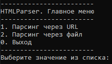
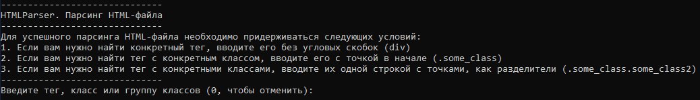

# HTMLParser
Парсинг HTML по URL или файлу

## Стэк
- Java 21 ([JDK](https://www.oracle.com/java/technologies/javase/jdk21-archive-downloads.html))
- JSoup 1.17.1 ([Сайт](https://jsoup.org/) | [Git](https://github.com/jhy/jsoup) | [Maven](https://mvnrepository.com/artifact/org.jsoup/jsoup/1.17.1))
- EasyConsole 1.0 ([Git](https://github.com/LightHerooo/EasyConsole))

## Установка
1. Скачайте [ZIP](https://disk.yandex.ru/d/NZgVQfN43m2CvA)
2. Распакуйте архив

## Использование
Запустите файл `run.bat`.

Первое, что вы увидите - главное меню. В нём вы можете выбрать одну из стратегий парсинга.

Если вы выберете **Парсинг по URL**, то необходимо указать ссылку на любой сайт.

Если вы выберете **Парсинг по файлу**, то необходимо указать полный путь к файлу.

Вне зависимости от стратегии, следующим шагом будет **указание правила для парсера**: парсить по тегу, классу или группе классов.

В случае, если указанные теги или классы были найдены, они будут отображены. Далее вам предстоит выбор, каким будет **результат парсинга**.

В зависимости от выбранного пункта, результат будет отличаться:
- Сохранить всё (в файл будет сохранено всё, что нашлось)
- Сохранить содержимое найденных тегов (в файл будет сохранено только то содержимое, что находится внутри найденных тегов)
- Сохранить внутренний текст (в файл будет сохранён только внутренний текст найдённого тега или его последнего дочернего элемента)
- Сохранить значения атрибута найденного тега (при выборе данного пункта необходимо ввести название атрибута, значение которого будет сохранено в файл)

После успешного завершения парсинга будет создан файл в директории `/results` с названием `result_ДЕНЬ_МЕСЯЦ_ГОД__ЧАС_МИНУТА_СЕКУНДА.txt`. Директория `/results` появится в директории, где находится `HTMLParser.jar`.
